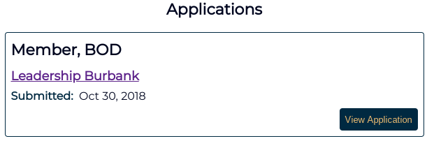

# Nonprofit Board Match MVP

__[Live demo of current build (Heroku)](https://serene-chamber-93065.herokuapp.com)__

A platform for connecting service-oriented individuals with local non-profit
organizations in search of board-level support.

_Note: This is a "minimum viable product" prototype for a larger application.
This application was built using `Node.js, Express, and MongDB`. The full platform
would be built using a framework, such as `React [+Native]`._

## Motivation

Build an easy-to-use and attractively designed app that demonstrates to
potential stakeholders the following functionalities:

* Create and manage user accounts and profiles
* Browse open board positions, each connected with local non-profit organizations
* Submit applications for open positions

### Internal motivation

I intentionally developed without an advanced framework in order to
strengthen my core full-stack development capabilities. In particular, I focused
on the following skills:

* Test-driven development (TDD)
* Component-based web app designed
* Server-side APIs providing full CRUD capabilities
* Using `promises` to manage complex asynchronous function chains

I also built this without a framework in following with the *"Every Jedi must
build his own lightsaber"* philosophy - constructing a product from the ground up
to gain a deeper understanding and appreciation of the technologies and techniques
involved in its creation.

## Screenshots

### Wireframe stage

_The following screenshots were captured after the initial functional build was
complete, but incorporating only minimal CSS styling._

#### Login & Account Creation views

#### Profile & Edit Profile views

#### Open Positions & Apply views

## Technologies used

* Languages/modules:
  * HTML
  * CSS
  * Javascript
  * JQuery
  * Node.js
  * Express
  * Mongoose
* Testing:
  * Mocha
  * Chai
  * Sinon
  * Faker
* Development/hosting environment
  * AWS
  * mLab
  * Travis-CI
  * Git(Hub)
  
## Live Demo (current deployment)

<https://serene-chamber-93065.herokuapp.com>

## Development Roadmap

When transitioning this app from prototype to production, the following items
(among others) would be included on the development roadmap:

* General
  * Rebuild front-end using `React`, plus `React Native` mobile interface
* Landing page & login  
  * Google/Facebook OAuth login pathways
  * Full landing page and supporting website
* Individual profiles
  * Upload custom profile photos
  * LinkedIn API integration
  * More content-rich individual profile information
  * "Additional experience" component, w/ "Add/remove experience" functionality
  * Upload PDF/DOCX resumes
* Organization management
  * User-editable organization profiles
  * More content-rich orgnization profile information
  * User-creatable open positions
* Positions
  * More content-rich position descriptions, including organiation logos
  * Positions can be opened/closed by organization manager
* Applications
  * Email notification of application submission
  * Individual  profiles included with application submission
  * Application management for organizational users

## Wireframe Readme (pre-CSS documentation)

[README-wireframes.md](./README-wireframes.md)