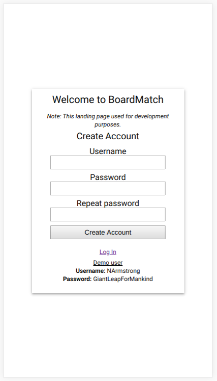

# Nonprofit Board Match MVP

__[Preview current build (Heroku)](https://serene-chamber-93065.herokuapp.com)__

A platform for connecting service-oriented individuals with local non-profit
organizations in search of board-level support.

_Note: This is a "minimum viable product" prototype for a larger application.
This application was built using `Node.js, Express, and MongoDB`. The full platform
would be built using a framework, such as `React [+Native]`._

## Motivation

Build an easy-to-use and attractively designed app that demonstrates to
potential stakeholders the following functionalities:

* Create and manage user accounts and profiles
* Browse open board positions, each connected with local non-profit organizations
* Submit applications for open positions

### Internal motivation

This app was intentionally developed without an advanced framework in order to
strengthen my core full-stack development capabilities. In particular, I focused
on the following skills:

* Test-driven development (TDD)
* Component-based web app designed
* Server-side APIs providing full CRUD capabilities
* Using `promises` to manage complex asynchronous function chains

## Screenshots

### Wireframe stage

_The following screenshots were captured after the initial functional build was
complete, but incorporating only minimal CSS styling._

#### Login & Account Creation views

#### Profile & Edit Profile views

#### Open Positions & Apply views

